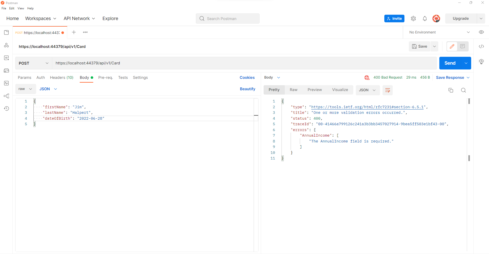
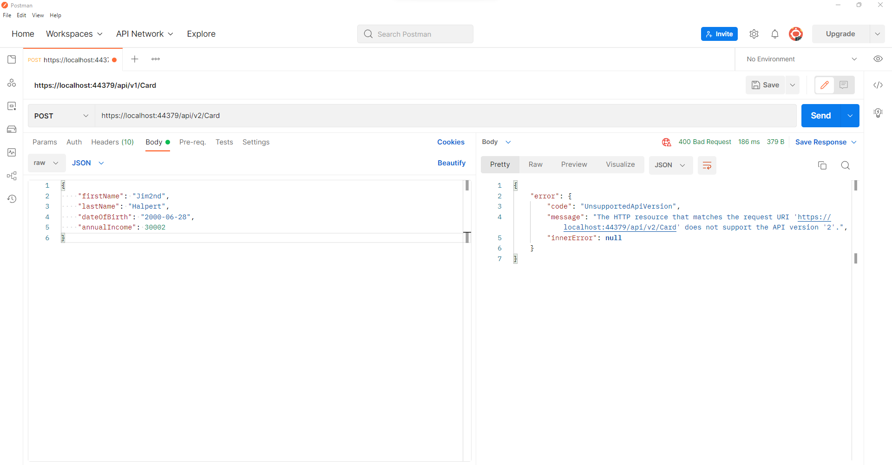

# Experian - Marketplaces

An ASP.net core web API to find appropriate card for customer.

## pre-requisites
1. SQL Server express

Images 

1. Making request without mandatory data.

2. Making request with incorrect versioning number.

