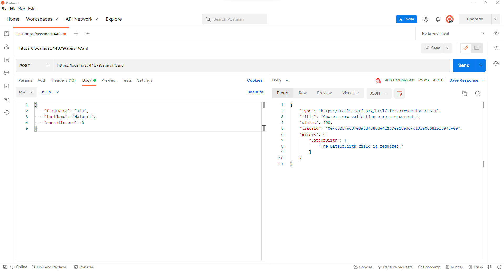
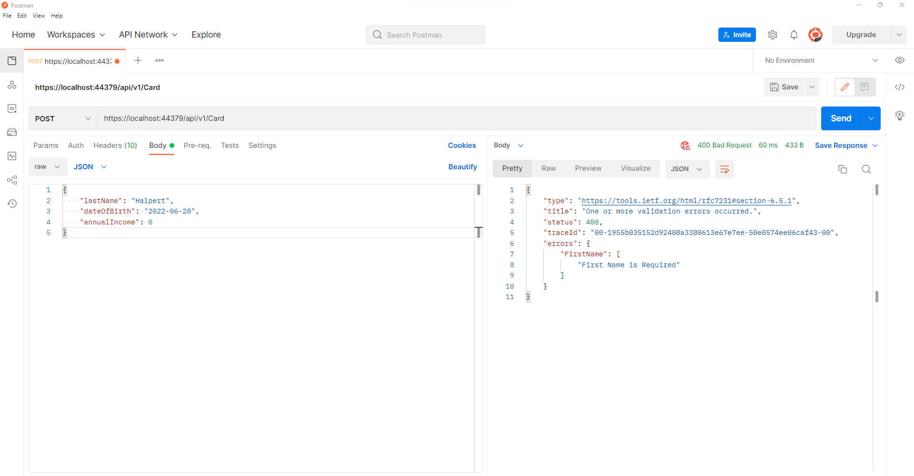
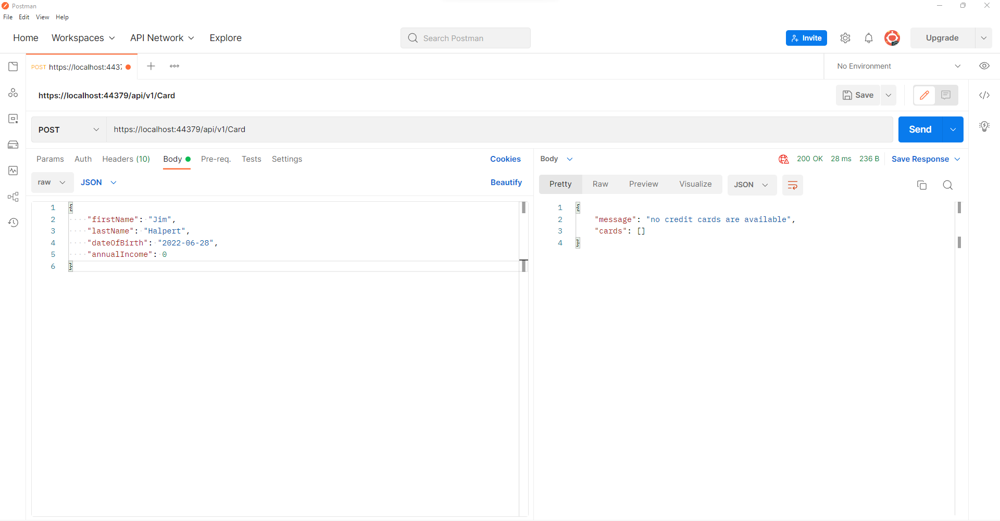
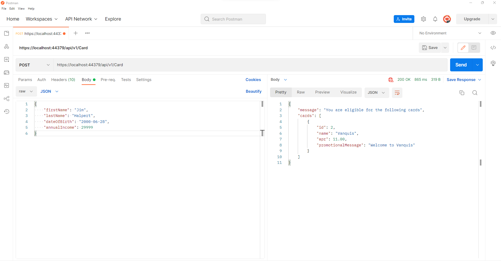

# Experian - Marketplaces

An ASP.net core web API to find appropriate card for customer.

## pre-requisites
1. SQL Server express

## Images 

###### 1. Making request without mandatory data.

###### 2. Making request with incorrect versioning number.

###### 3. Below 18 request.

###### 3. Annual income below 30000.

###### 3. Annual income above 30000.

