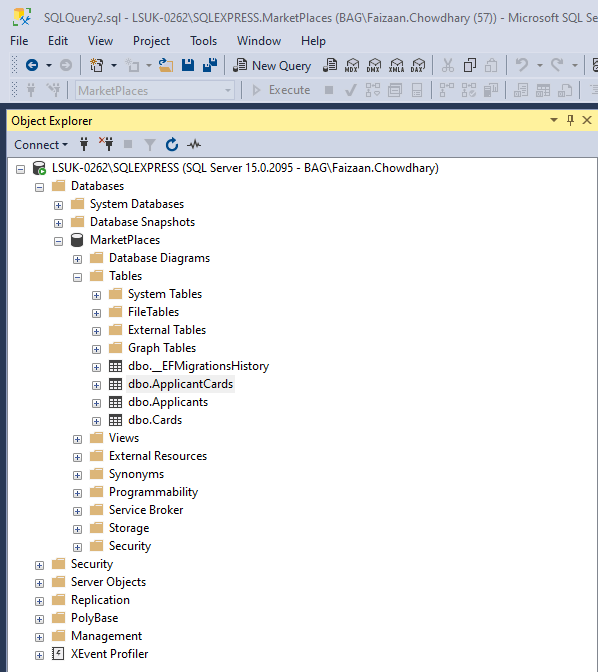

# Experian - Marketplaces

An ASP.net core web API to find appropriate card for customer. Scroll to bottom of the page to read improvements or to-do that can be made to the application.

## pre-requisites
1. SQL Server express

## Images 

###### 1. Making request without mandatory data.

###### 2. Making request with incorrect versioning number.

###### 3. Below 18 request.

###### 3. Annual income below 30000.

###### 3. Annual income above 30000.

###### 3. Marketplaces Database.

###### 3. Applicant detail table saving applicant details.

###### 3. Applicant results that were shown with their card results.

###### 3. All cards available on the system.

## Improvements to the application
1. Unit testing for services, repository and helper classes.
2. Adding comments on top of functions or Documenting code.
3. Not using magic numbers like 30,000 find a way to store them or use them more appropriately.
4. Defaulting to an API version if not found.
5. Making all models inherit from a base model class.
